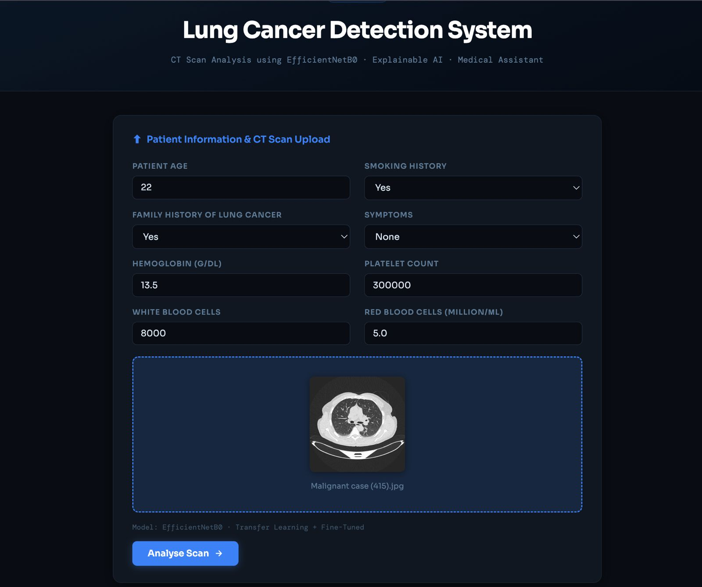
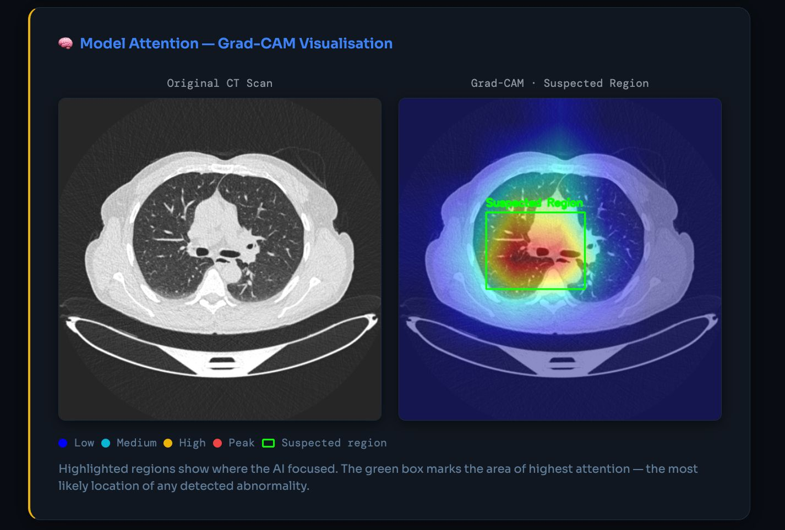
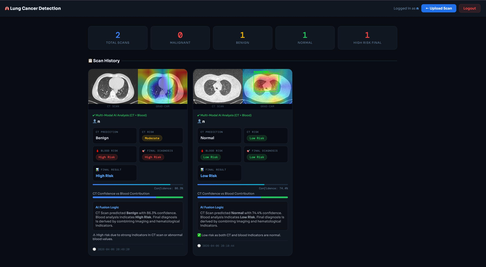

# AI-Powered Lung Cancer Detection System

A web-based AI system for detecting lung cancer using **CT scan images + blood test data**.

It combines:
- Deep Learning (EfficientNetB0)
- Machine Learning (Blood Analysis Model)
- Explainable AI (Grad-CAM)
- Patient Dashboard & Reports

---

## 🚀 Project Idea (Simple Explanation)

This system helps in **early detection of lung cancer** by analyzing:

1. **CT Scan Image (primary diagnosis)**
2. **Blood parameters (supporting diagnosis)**

Then it **combines both results** to give a **final risk prediction**.

---

## 🧠 How the System Works

### Step 1: CT Scan Model
- User uploads CT scan image
- Model predicts:
  - Normal
  - Benign
  - Malignant
- Also gives confidence %

---

### Step 2: Blood Analysis Model
User enters:
- Hemoglobin  
- Platelets  
- White Blood Cells (WBC)  
- Red Blood Cells (RBC)

Model predicts:
- Low Risk  
- High Risk  

---

### Step 3: Final Decision (Fusion Logic)

We combine both results:

- If CT = Malignant OR Blood = High Risk → **High Risk**
- If CT = Benign → **Moderate Risk**
- Else → **Low Risk**

This makes the system closer to real-world diagnosis.

---

## 🎯 Key Features

### ✅ CT Scan Prediction
Deep learning model (EfficientNetB0) detects lung abnormalities.

---

### ✅ Blood-Based Risk Prediction
Machine learning model uses blood values to estimate risk.

---

### ✅ Final Combined Diagnosis
Combines CT + blood results for better prediction.

---

### ✅ Grad-CAM (Explainable AI)
Shows where the model is focusing in the CT scan.

---

### ✅ Patient Dashboard
- Stores scan history
- Shows:
  - CT Result
  - Blood Risk
  - Final Diagnosis
  - Confidence

---

### ✅ PDF Report
Download complete medical-style report with:
- Patient data
- Results
- Images
- Final diagnosis

---

### ✅ AI Chatbot
- Explains results
- Suggests next steps
- Helps users understand predictions

---

## 🛠️ Technologies Used

### Machine Learning
- TensorFlow
- EfficientNetB0  
- XGBoost (Blood model)  
- Scikit-learn  

### Backend
- Python  
- Flask  

### Database
- Supabase  

### Frontend
- HTML  
- CSS  
- JavaScript  
- Chart.js  

### Others
- Grad-CAM  
- ReportLab  

---

## 📁 Project Structure

```
lung-cancer-detection

├── app
│   ├── app.py
│   ├── chatbot.py
│   ├── database.py
│   ├── gradcam.py
│   └── report_generator.py

├── templates
│   ├── index.html
│   └── dashboard.html

├── static
│   ├── style.css
│   ├── images
│   └── heatmaps

├── models
│   ├── efficientnet_final.h5
│   ├── blood_model.pkl
│   └── scaler.pkl

├── requirements.txt
└── README.md
```

---

## ⚙️ How to Run

```bash
git clone <your-repo-link>
cd lung-cancer-detection
python -m venv venv
source venv/bin/activate   # Mac/Linux
pip install -r requirements.txt
python app.py
```

Open:
```
http://127.0.0.1:5001
```

---

## 📊 Model Details

### CT Model
- EfficientNetB0
- Transfer Learning
- Image size: 224x224

### Blood Model
- Trained on blood parameters
- Handles class imbalance

---

## 📸 Screenshots 

Add these images for better presentation:

- Home Page (upload UI)
- Prediction Result (CT + Blood + Final)
- Grad-CAM visualization
- Dashboard (history view)

Example:

```
## Screenshots




```

---


